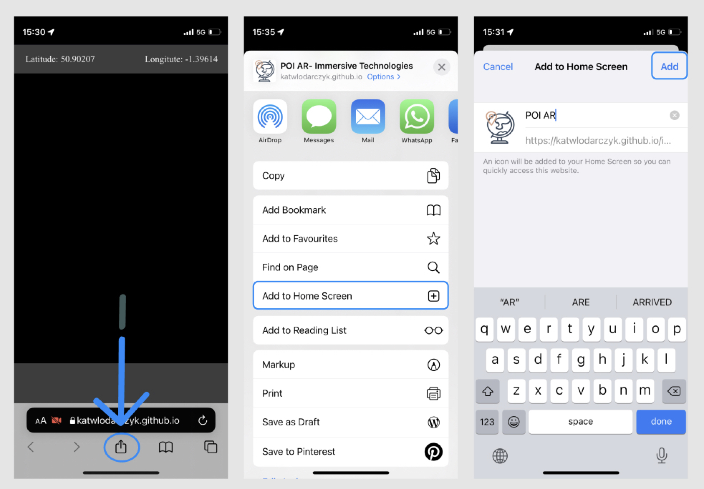
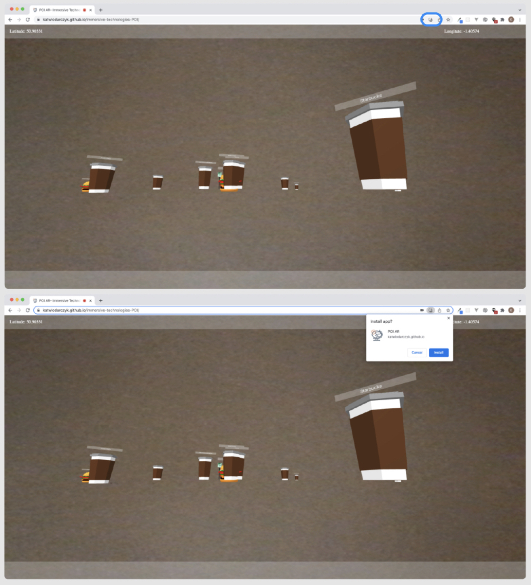
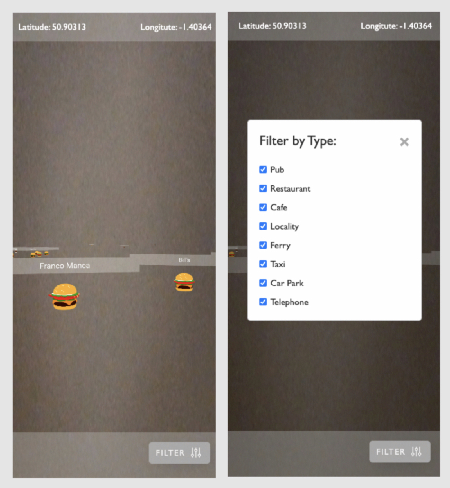

# POI AR
## Points Of Interest augmented reality web app using A-Frame and AR.JS

### This AR web app will help you find points of interest (cafes, restaurants, pubs, etc.) in your location and display a 3D Model and a name of a point. 

#

Hosted on: 

https://katwlodarczyk.github.io/immersive-technologies-POI/
#
To run the poject locally: 

```npm install``` to install all the dependencies 

```npm run watch``` to watch for changes 

and open ```index.html``` with a LiveServer

#
To install the app on your mobile with IOS operating system, follow the instructions below:




When opening on Android operating system, install alert should pop up when opening the website for the first time.

#
To install app on your desktop, click on the button on the address bar and click 'Install'



#

You can filter which type of POI you would like to explore by checking/unchecking the speciffic type:



#

The project is using following 3D Models: 

- "Beer Bottle" (https://skfb.ly/6SKTV) by gelmi.com.br is licensed under Creative Commons Attribution (http://creativecommons.org/licenses/by/4.0/).

- "Cheese Burger" (https://skfb.ly/6RPzV) by Bob.Ho is licensed under Creative Commons Attribution (http://creativecommons.org/licenses/by/4.0/)

- "Low-Poly Coffee Cup" (https://skfb.ly/6TN8u) by axeboyd123 is licensed under Creative Commons Attribution (http://creativecommons.org/licenses/by/4.0/).

- "Point Marker" (https://skfb.ly/RXsI) by whoiskeo is licensed under Creative Commons Attribution (http://creativecommons.org/licenses/by/4.0/).

- "Parking Sign" (https://skfb.ly/69yYA) by elouisetrewartha is licensed under Creative Commons Attribution-NonCommercial (http://creativecommons.org/licenses/by-nc/4.0/)